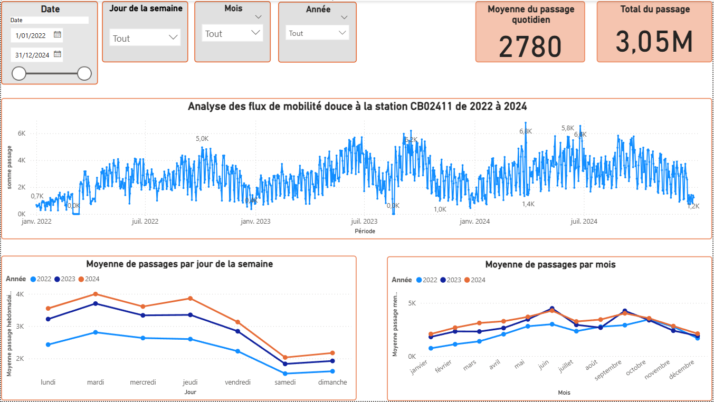
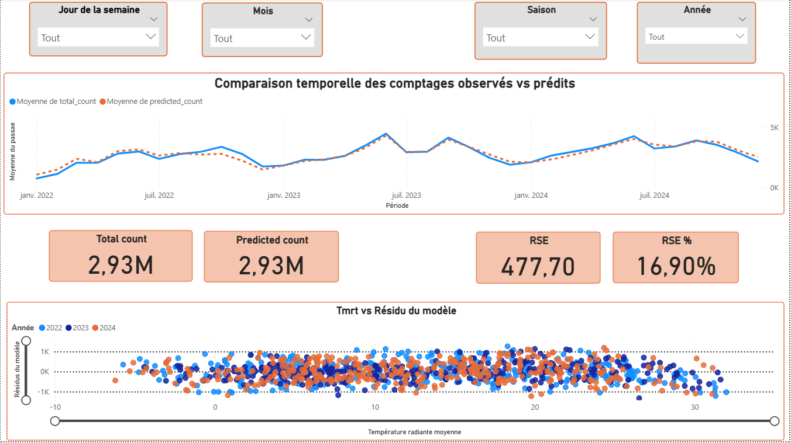

## Sommaire
1. [Objectif](#objectif)
2. [Méthodologie](#méthodologie)
3. [Fichiers](#fichiers)
4. [Exemple du tableau de bord Power BI](#exemple-du-tableau-de-bord-power-bi)
5. [Variables d’environnement](#variables-denvironnement-requises)
6. [Reproduire](#reproduire)


# Analyse des flux cyclistes à Bruxelles (CB02411)
**ACP + HCPC + Régression multiple en R** — Connexion directe **MySQL** via `{RMariaDB}` — Dashboard **Power BI**.

## Objectif
Comprendre l’évolution des passages vélo à Bruxelles (2022–2024), identifier des profils de stations (jour/nuit, semaine/saisons) et modéliser les facteurs explicatifs (calendrier, météo).

## Méthodologie
1) **Données** : connexion MySQL avec `{RMariaDB}` (stations/horaires) + données calendaires (vacances/jours fériés).  
2) **R (tidyverse)** : nettoyage, features temporelles.  
3) **ACP (FactoMineR) + HCPC** : typologie de stations.  
4) **Régression multiple** (avec imputation `mice`, retrait outliers/Cook).  
5) **Power BI** : tableau de bord interactif (observé vs ajusté, filtres).

## Fichiers
- Script : [`bicycle-project/code.R`](bicycle-project/code.R)  
- Données calendaires : [`data/Vacances FR-NL.csv`](data/Vacances%20FR-NL.csv)  
- Rapport PDF : [`results/Analyse-borne-CB02411.pdf`](results/Analyse-borne-CB02411.pdf)  
- Dashboard : [Télécharger le Dashboard (PBIX)](results/Dashboard-CB02411.pbix?raw=1)


## Exemple du tableau de bord Power BI

Voici un aperçu du dashboard construit avec Power BI :





### Variables d’environnement requises
Le script R attend des identifiants de connexion MySQL via `{RMariaDB}`.  
Avant d’exécuter `code.R`, définissez :

- `DB_USER` : utilisateur MySQL
- `DB_PASS` : mot de passe
- `DB_HOST` : hôte/serveur MySQL
- `DB_NAME` : nom de la base de données

Exemple (sous Linux/macOS) :
```bash
export DB_USER="mon_user"
export DB_PASS="mon_motdepasse"
export DB_HOST="localhost"
export DB_NAME="nom_base"
```
## Reproduire
```r
# Connexion MySQL (adapter les secrets)
con <- DBI::dbConnect(RMariaDB::MariaDB(),
                      user="USER", password="***",
                      dbname="DB", host="HOST", port=3306)

# Exécuter l'analyse
source("bicycle-project/code.R")
